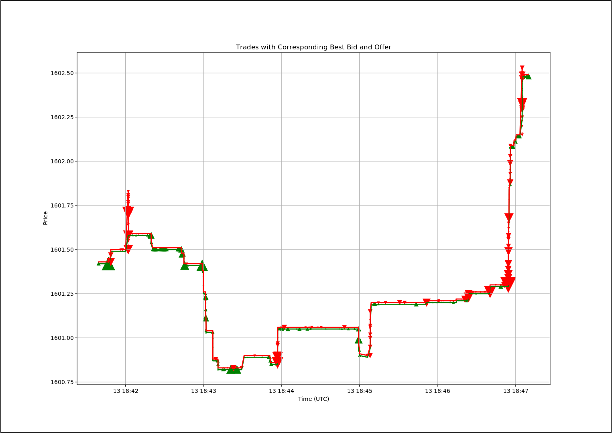

# Harnessing Rapid Market Data: Crafting a High-Speed Binance Feed Server in C++

## **Introduction**

In the high-stakes world of financial markets, mere microseconds—or even nanoseconds—can determine the success or failure of a trade. It's undisputed: **low-latency and reliable** market data is of primary concern. The vast expanse of trading operations stretches across a complicated, **distributed** network of computational processes globally, each craving up-to-date market data. Within this web, enterprises employ a wide range of tools and technologies. To maintain coherence, **versatility and interoperability** across a wide spectrum of technologies becomes crucial. Furthermore, trading, at its core, is a competitive experimental science. The capability of a market data platform in swiftly **capturing** and availing data for research and simulations is of the highest importance for adaptive reactions to market flux.

Our blog series aims to conceptualize a market data platform that addresses the intricate balance of demands on trading technology which makes algorithmic trading a formidable and captivating endeavor. In this inaugural entry, we'll delve deep into the low-latency facet of trading. Herein, we'll construct a rapid Binance Feed Server in C++, deploy multiple servers simultaneously for optimal load distribution, scrutinize the feed server's performance, and culminate with crafting a basic trade plotter via the Python API.

But why is swift market data indispensable in trading? Timely reactions to market swings are crucial. A tardy trading strategy risks outdated data, jeopardizing its efficiency by the time orders penetrate the market. Contemporary trading is fiercely competitive, where immediate action on lucrative trades holds the key. Conversely, sluggish strategies risk "adverse selection"—settling for trades discarded by others. Data lags can lead to packet loss, skewing market perspectives and potentially causing data backlogs—particularly in non-parallelizable strategies. An efficient market data system economizes resources. Imagine the fiscal contrast in operating five servers versus twenty; it resonates with both small and large-scale entities.

## **Why Binance?**

Binance stands out for its accessible public interface and user-friendly API. Numerous open-source feed handlers, designed for Binance and optimized for low latency, are at one's disposal. At the same time, the principles of low latency and elements concerning distribution and capture are largely synonymous across equity, futures, and FX market data feeds.

## **Libwebsockets**

[Libwebsockets](https://github.com/warmcat/libwebsockets) stands out as a nimble, pure C library tailored for using contemporary network protocols without a hassle. The library has a minuscule footprint and leverages a non-blocking event loop. Crucially for our objectives, it's well-suited to manage a singular connection, emphasizing the latency of every message. Importantly, the library provides a detailed example of accessing Binance market data, serving as our foundation.

## **Featuremine Yamal**

[Yamal](https://github.com/featuremine/yamal) is an open-source library geared towards transactional low-latency IPC and data capture. It is used to build systems where data is communicated and captured between different processes very quickly, emphasizing the consistency and reliability of that data. This is especially important in environments where fast, reliable data transmission and storage are essential, such as financial trading platforms or real-time analytics systems. Yamal's key features for our context include:
- **Performance**: Astoundingly low latencies - 100ns (median) and 1us (max) on a Ryzen 7950X.
- **Atomicity**: Ensures the entire update to the bus is either done or not done at all.
- **Consistency**: Ensures that data remains consistent across various processes.
- **Resilience**: In the event of application crashes, data is not lost.
- **Zero-copy**: Abstains from data copying during read/write.
- **Simplicity**: Boasts an elementary C API and Python API.

Harnessing these features, we can seamlessly develop a feed server to distribute market data to other processes within the same system at breakneck speeds. For a more in-depth understanding of Yamal, visit https://github.com/featuremine/yamal.

## **Constructing the Binance Feed Server**

### **Getting Started**

We've created a repository containing all essential code snippets to facilitate this tutorial. Before diving in, ensure you've installed [git](https://git-scm.com/downloads), [CMake](https://cmake.org/download), and a C++ compiler toolchain. This project is compatible with contemporary Linux and MacOS setups. For Windows users, consider using either the Windows Subsystem for Linux (WSL) or a Docker container.

Kick-off by cloning the repository and setting up the build environment:
```bash
git clone --recurse-submodules https://github.com/featuremine/tutorials
cd tutorials
cmake -B release -DCMAKE_BUILD_TYPE=Release
cmake --build release
```
Post-build, locate the tutorial binaries under **release/market-data01-feedhandler**.

### **Decoding the libwebsocket Binance Sample**

To streamline the process, we've imported the Binance sample from libwebsocket into our tutorial repository. The file in focus is [minimal-ws-client-binance.c](https://github.com/featuremine/tutorials/blob/main/market-data01-feedhandler/minimal-ws-client-binance.c).

Take a moment to examine how the server and desired Binance streams are specified on the line [minimal-ws-client-binance.c:130](https://github.com/featuremine/tutorials/blob/ba5e6cda40f924b14019a483688ef52c22b07b2a/market-data01-feedhandler/minimal-ws-client-binance.c#L130):
```c
i.address = "fstream.binance.com";
i.path = "/stream?streams=btcusdt@depth@0ms/btcusdt@bookTicker/btcusdt@aggTrade";
```
Data from Binance, structured in JSON, is processed at line [minimal-ws-client-binance.c:247](https://github.com/featuremine/tutorials/blob/2f4257e82a68a69a24d3e63805610a0f5e113844/market-data01-feedhandler/minimal-ws-client-binance.c#L247). Despite being in JSON format, Binance's message structure remains consistent, negating the need for a comprehensive JSON parser. Familiarize yourself with the [Binance API docs](https://binance-docs.github.io/apidocs/spot/en/#websocket-market-streams) for further clarity. Within the code, `lws_json_simple_find` aids in locating the JSON key, a function we'll also employ in our application.
```c
case LWS_CALLBACK_CLIENT_RECEIVE:
    // ...
    p = lws_json_simple_find((const char *)in, len,
                    "\"depthUpdate\"", &alen);
```

### **Integrating Yamal**

Initially, we duplicated [minimal-ws-client-binance.c](https://github.com/featuremine/tutorials/blob/main/market-data01-feedhandler/minimal-ws-client-binance.c) to [binance-feed-handler.cpp](https://github.com/featuremine/tutorials/blob/main/market-data01-feedhandler/binance-feed-handler.cpp). This separation ensures our additions related to Yamal won't interfere with the original code. This feed handler is converted into a C++ application, facilitating the use of the C++ standard library.

Following this, we introduced command-line argument processing. Refer to [binance-feed-handler.cpp:313](https://github.com/featuremine/tutorials/blob/ff04f928715f00fbd06ab0271280519029d4ba78/market-data01-feedhandler/binance-feed-handler.cpp#L313) for clarity. Here, the `fmc_cmdline_opt_proc` utility, sourced from our Featuremine Common Library `libfmc`, comes in handy. This library is also accessible in the [Yamal repository](https://github.com/featuremine/yamal).

After this, we loaded securities from the file with an additional step to eliminate potential duplicates:
```c++
// load securities from the file
vector<string> secs{istream_iterator<string>(secfile), istream_iterator<string>()};
// sort securities
sort(secs.begin(), secs.end());
// remove duplicate securities
auto last = unique(secs.begin(), secs.end());
secs.erase(last, secs.end());
```

The subsequent steps involve opening the YTP file for reading and writing online [binance-feed-handler.cpp:351](https://github.com/featuremine/tutorials/blob/ff04f928715f00fbd06ab0271280519029d4ba78/market-data01-feedhandler/binance-feed-handler.cpp#L351), and creating an instance of Yamal object utilizing the [ytp_yamal_new](https://github.com/featuremine/yamal/blob/main/docs/Yamal-C-API.md#ytp_yamal_new) function.
```c++
mco.yamal = ytp_yamal_new(fd, &error);
if (error) {
    lwsl_err("could not create yamal with error %s\n", fmc_error_msg(error));
    return 1;
}
```
This instance is saved within the connection context, ensuring its availability during the WebSocket callback. It's essential to note that we verify the `error` pointer to ascertain if an error has taken place. Such a methodology is consistently applied in both the `libfmc` and `libytp` libraries. Adopting this approach streamlines error management across these libraries, mitigating typical error-handling pitfalls inherent in C libraries.

Yamal, in essence, is a series of memory-mapped linked lists. This architecture delivers impressive performance while retaining adaptability. The first list is used for data, while the second defines the logical data segmentation into `streams`. The `stream` is effectively a combination of a `peer` and a `channel`. Here, the `peer` indicates the data publisher, and the `channel` represents a global data category. The `YTP` or Yamal Transport Protocol outlines the procedure for data allocation to streams and the announcement of these streams within Yamal.

Each Binance stream is channeled to a distinct YTP channel for our project. Generating a stream announcement necessitates an instance of the streams object, which we create using the [ytp_streams_new](https://github.com/featuremine/yamal/blob/main/docs/Streams-C-API.md#ytp_streams_new) function.
```c++
auto *streams = ytp_streams_new(mco.yamal, &error);
```
Subsequently, for every security and required Binance feed (specifically `bookTicker` and `trade`), a relevant YTP stream is announced with [ytp_streams_announce](https://github.com/featuremine/yamal/blob/main/docs/Streams-C-API.md#ytp_streams_announce)
```c++
auto stream = ytp_streams_announce(streams, vpeer.size(), vpeer.data(),
                                   chstr.size(), chstr.data(),
                                   encoding.size(), encoding.data(),
                                   &error);
```
Given a stream ID, we can also look up the stream information using [ytp_announcement_lookup](https://github.com/featuremine/yamal/blob/main/docs/Announcement-C-API.md#ytp_announcement_lookup). The memory for stream information, such as channel name, is memory mapped and stored within the Yamal file itself. This is handy since, to avoid unnecessary copy, we wanted to use `string_view` instead of `string` as the key in the C++ `unordered_map` used to look up YTP streams.
```c++
ytp_announcement_lookup(mco.yamal, stream, &seqno, &psz, &peer,
                        &csz, &channel, &esz, &encoding, &original,
                        &subscribed, &error);
mco.streams.emplace(string_view(channel, csz), stream);
```
Also, for every security and required Binance feed, we add the corresponding Binance stream name to the path variable `i.path`, which we use to specify the WebSocket connection path:
```c++
i.path = mco->path.c_str();
```
We are almost done. We just need to write the data we received from Binance to Yamal. Starting online [binance-feed-handler.cpp:210](https://github.com/featuremine/tutorials/blob/a53660e5911ec7120f0cc122287bd7e5a0d04b7d/market-data01-feedhandler/binance-feed-handler.cpp#L210) we first isolate the Binance stream name, then the actual update data from the message. Then, we look up the corresponding YTP stream and write the data as follows:
```c++
auto dst = ytp_data_reserve(mco->yamal, data.size(), &err);
// ...
memcpy(dst, data.data(), data.size());
ytp_data_commit(mco->yamal, fmc_cur_time_ns(), where->second, dst, &err);
```
Notice that we first reserve the data using [ytp_data_reserve](https://github.com/featuremine/yamal/blob/main/docs/Data-C-API.md#ytp_data_reserve), then commit that data to Yamal with [ytp_data_commit](https://github.com/featuremine/yamal/blob/main/docs/Data-C-API.md#ytp_data_commit). Data is not available for reading until you commit it and the commit is atomic. This is important because other readers will never see partially written data.

Finally, we made a few minor adjustments and improvements, and we are done.

### **Validating and Assessing Performance**

Now, it's time to test our feed handler in action. We've prepared two files for this exercise, each containing a curated list of securities. To start, run one feed handler instance:
```bash
./release/market-data01-feedhandler/binance-feed-handler --securities market-data01-feedhandler/securities1.txt --peer feed --ytp-file mktdata.ytp
```
To check content directly, we need Yamal tools. For this blog, these utilities are built together with a tutorial project. To install these utilities normally you can either download one of the [releases](https://github.com/featuremine/yamal/releases) or build from source directly. Let's first run `yamal-tail` to dump the content of the file to the screen
```bash
./release/dependencies/build/yamal/yamal-tail -f mktdata.ytp
```
Now, we can run another feed handler with the second set of securities.
```bash
./release/market-data01-feedhandler/binance-feed-handler --securities market-data01-feedhandler/securities2.txt --peer feed --ytp-file mktdata.ytp
```
We can run `yamal-stats` to see that the streams corresponding to the second set of securities also appear in Yamal.
```bash
./release/dependencies/build/yamal/yamal-stats mktdata.ytp
```
Finally, we can run `yamal-local-perf` to monitor the performance of the yamal bus. This tool listens to the latest messages and displays a histogram of differences between the time on the message and the time the message is received. In our case, since the message time is immediately before committing the message to Yamal, the difference corresponds to the time it takes to transmit a message over Yamal.
```bash
./release/dependencies/build/yamal/yamal-local-perf --ytp-file mktdata.ytp
```

### **Data Integration for Trade Visualization**

Concluding this tutorial, we'll guide you on leveraging the market data from Yamal. We've added a Python utility that plots a given number of trades together with the corresponding best bid and offer reported at the time of the trade.

To set up the Python environment, simply run:
```bash
pip install -r market-data01-feedhandler/requirements.txt
```

Now to plot the data, run:
```bash
python3 market-data01-feedhandler/binance-view.py --ytp-file mktdata.ytp --security btcusdt --points 1000
```
If you require a backend to be explicitly specified, you can do it through the MLPBACKEND environment variable. You may find additional details regarding the availability of the backends at [the matplotlib backends documentation website](https://matplotlib.org/stable/users/explain/backends.html).

You should see something like this


The script is well-documented and should be easy to follow. Please refer to Yamal documentation for additional information on [Yamal Python API](https://github.com/featuremine/yamal/blob/main/docs/YTP-Python-API.md).

### **Conclusion**

By following this tutorial, you've built a blazing-fast Binance feed server and utility to visualize the market data. The integration of Yamal into your C++ application equips you with the potential to manage high-frequency data efficiently. Going forward, you can adapt this foundational codebase to cater to a broad spectrum of trading applications and analytics tools. Happy coding!

## **Feedback**

We value the perspectives and insights of our readers. Your experiences and feedback not only enrich the content but also shape our future posts, ensuring they remain relevant and beneficial for all. Whether it's a query, a suggestion, or a personal anecdote related to the topic, we encourage you to share it with us. By fostering an interactive community, we can all grow and learn together. Please don't hesitate to reach out and share your thoughts!
