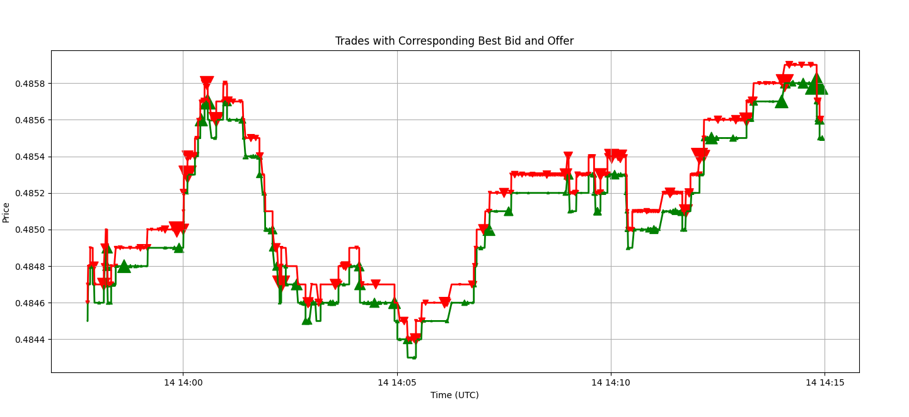

# Harnessing Rapid Market Data: Crafting a High-Speed Binance Feed Server in C++

## **Introduction**

In the fast-paced world of financial markets, every split second counts and can make or break a trade. It's a no-brainer: having fast and reliable market data is the name of the game. Trading operations sprawl across a complex network of computer processes worldwide, all hungry for the latest market information. In this vast web, businesses use a variety of tools and technologies to keep things running smoothly. To keep it all together, flexibility and the ability to work with different technologies are crucial. And remember, trading is basically a competitive science experiment. The ability of a market data platform to quickly grab and provide data for research and simulations is top priority for reacting intelligently to market changes.

It's the juggling act of demands on trading technology that makes algorithmic trading such an exciting and challenging field. Our mission with this blog series is to come up with a market data platform that meets all these complex requirements. In this first post, we'll dive deep into the need for speed in trading. We'll build a lightning-fast Binance Feed Server in C++, set up multiple servers at once for the best performance, analyze how the feed server is doing, and finish up by creating a basic trade plotter using the Python API.

But why is fast market data so critical in trading? Quick reactions to market changes are everything. A sluggish trading strategy risks using outdated data, which can hurt its effectiveness by the time orders hit the market. Today's trading world is cutthroat, and being able to act immediately on profitable trades is key. Slow strategies, on the other hand, risk falling behind and settling for trades that others have already passed up. Data delays can result in lost information, skewing your view of the market and potentially causing data pileups. An efficient market data system also saves money. Think about the financial difference between running five servers versus twenty - it's a big deal for both small and big players in the market.

## **Why Binance?**

Binance stands out for its accessible public interface and user-friendly API. Numerous open-source feed handlers, designed for Binance and optimized for low latency, are at one's disposal. At the same time, the principles of low latency and elements concerning distribution and capture are largely synonymous across equity, futures, and FX market data feeds.

## **Libwebsockets**

[Libwebsockets](https://github.com/warmcat/libwebsockets) stands out as a nimble, pure C library tailored for using contemporary network protocols without a hassle. The library has a minuscule footprint and leverages a non-blocking event loop. Crucially for our objectives, it's well-suited to manage a singular connection, emphasizing the latency of every message. Importantly, the library provides a detailed example of accessing Binance market data, serving as our foundation.

## **Featuremine Yamal**

[Yamal](https://github.com/featuremine/yamal) is an open-source library geared towards transactional low-latency IPC and data capture. It is used to build systems where data is communicated and captured between different processes very quickly, with an emphasis on ensuring the consistency and reliability of that data. This is especially important in environments where fast, reliable data transmission and storage are essential, such as financial trading platforms or real-time analytics systems. Yamal's key features for our context include:
- **Performance**: Astoundingly low latencies - 100ns (median) and 1μs (max) on a Ryzen 7950X.
- **Atomicity**: Ensures the entire update to the bus is either done or not done at all.
- **Consistency**: Ensures that data remains consistent across various processes.
- **Resilience**: In the event of application crashes, data is not lost.
- **Zero-copy**: Abstains from data copying during read/write.
- **Simplicity**: Boasts an elementary C API and Python API.

Harnessing these features, we can seamlessly develop a feed server to distribute market data to other processes within the same system at breakneck speeds. For a more in-depth understanding of Yamal, visit https://github.com/featuremine/yamal.

## **Constructing the Binance Feed Server**

### **Getting Started**

To facilitate this tutorial, we've created a repository containing all of the relevant code. Before diving in, ensure you've installed [git](https://git-scm.com/downloads), [CMake](https://cmake.org/download), C++ compiler toolchain and set up your favorite development environment. For example, [here](https://code.visualstudio.com/docs/languages/cpp) is the reference on how to set up Visual Studio Code. This project is compatible with contemporary Linux and MacOS setups. For Windows users, consider using either the Windows Subsystem for Linux (WSL) or a Docker container.

Kick off by cloning the tutorial repository, setting up the build directory and running the build:
```bash
git clone --recurse-submodules https://github.com/featuremine/tutorials
cd tutorials
cmake -B release -DCMAKE_BUILD_TYPE=Release
cmake --build release
```
Post-build, you should be able to find the tutorial binaries under **release/market-data01-feedhandler**. All of the relevant sources are in the market-data01-feedhandler directory of the repository.

If you would like to jump straight to the results and avoid the in-depth discussion of the code, you can skip to the **Validating and Assessing Performance** section.

### **Decoding the libwebsocket Binance Sample**

We’ve made the process easier by bringing in the Binance example from libwebsockets into our tutorial repository. You’ll want to check out the file named [minimal-ws-client-binance.c](https://github.com/featuremine/tutorials/blob/main/market-data01-feedhandler/minimal-ws-client-binance.c).

It will be important later to adjust WebSocket path depending on the feeds we want to receive. So let’s take a moment to examine how the connection details are specified in the example on line [130](https://github.com/featuremine/tutorials/blob/ba5e6cda40f924b14019a483688ef52c22b07b2a/market-data01-feedhandler/minimal-ws-client-binance.c#L130):
```c
i.address = "fstream.binance.com";
i.path = "/stream?streams=btcusdt@depth@0ms/btcusdt@bookTicker/btcusdt@aggTrade";
```
Also, we’ll need to change how received data from Binance is processed. This happens on line [247](https://github.com/featuremine/tutorials/blob/2f4257e82a68a69a24d3e63805610a0f5e113844/market-data01-feedhandler/minimal-ws-client-binance.c#L247). Despite being in JSON format, Binance’s message structure remains consistent, negating the need for a comprehensive JSON parser. Take a look at the [Binance API docs](https://binance-docs.github.io/apidocs/spot/en/#websocket-market-streams) if you would like more details. Within the example, `lws_json_simple_find` function is used to locate the JSON key in the message:
```c
case LWS_CALLBACK_CLIENT_RECEIVE:
    // ...
    p = lws_json_simple_find((const char *)in, len,
                    "\"depthUpdate\"", &alen);
```
This function is quite simple and we will use it in our application as well.

### **Integrating Yamal**

First we copied the libwebsockets example to [minimal-ws-client-binance.c](https://github.com/featuremine/tutorials/blob/main/market-data01-feedhandler/minimal-ws-client-binance.c) to ensure our additions related to Yamal won’t interfere with the original code. We’ve also changed the language to C++ to allow us to use the C++ standard library.

Next, on line line [313](https://github.com/featuremine/tutorials/blob/ff04f928715f00fbd06ab0271280519029d4ba78/market-data01-feedhandler/binance-feed-handler.cpp#L313), we introduced command-line argument processing. Here, the `fmc_cmdline_opt_proc` utility, sourced from our Featuremine Common Library `libfmc`, comes in handy. This library has C API and contains various cross-platform utility functions. It is distributed together with `libytp` and is also accessible from the [Yamal repository](https://github.com/featuremine/yamal).

Once we added argument parsing, we added code to load securities from the file with the additional step to eliminate potential duplicates:
```c++
// load securities from the file
vector<string> secs{istream_iterator<string>(secfile), istream_iterator<string>()};
// sort securities
sort(secs.begin(), secs.end());
// remove duplicate securities
auto last = unique(secs.begin(), secs.end());
secs.erase(last, secs.end());
```

The subsequent steps involved logic for opening the YTP file for reading and writing on line  [binance-feed-handler.cpp:351](https://github.com/featuremine/tutorials/blob/ff04f928715f00fbd06ab0271280519029d4ba78/market-data01-feedhandler/binance-feed-handler.cpp#L351), and creating an instance of Yamal object utilizing the [ytp_yamal_new](https://github.com/featuremine/yamal/blob/main/docs/Yamal-C-API.md#ytp_yamal_new) function.
```c++
mco.yamal = ytp_yamal_new(fd, &error);
if (error) {
    lwsl_err("could not create yamal with error %s\n", fmc_error_msg(error));
    return 1;
}
```
The Yamal instance is saved within the connection context, ensuring its availability during the WebSocket receive callback. It’s essential to note that we verify the `error` pointer to ascertain if an error has taken place. Such a methodology is consistently applied in both the `libfmc` and `libytp` libraries. Adopting this approach streamlines error management across these libraries, mitigating typical error-handling pitfalls inherent in C libraries.

Yamal, in essence, is a series of memory-mapped linked lists. This architecture delivers impressive performance while retaining adaptability. The first list is used for data, while the second defines the logical data segmentation into `streams`. The `stream` is effectively a combination of a `peer` and a `channel`. Here, the `peer` indicates the data publisher, and the `channel` represents a global data category. The `YTP` or Yamal Transport Protocol outlines the procedure for data allocation to streams and the announcement of these streams within Yamal.

For our project, each Binance stream is channeled to a distinct YTP channel. Generating a stream announcement necessitates an instance of the streams object, which we create using the [ytp_streams_new](https://github.com/featuremine/yamal/blob/main/docs/Streams-C-API.md#ytp_streams_new) function.
```c++
auto *streams = ytp_streams_new(mco.yamal, &error);
```
Subsequently, for every security and required Binance feed (specifically `bookTicker` and `trade`), a relevant YTP stream is announced with [ytp_streams_announce](https://github.com/featuremine/yamal/blob/main/docs/Streams-C-API.md#ytp_streams_announce), which returns the ID of the stream:
```c++
auto stream = ytp_streams_announce(streams, vpeer.size(), vpeer.data(),
                                   chstr.size(), chstr.data(),
                                   encoding.size(), encoding.data(),
                                   &error);
```
Given a stream ID, we can also look up the stream information using [ytp_announcement_lookup](https://github.com/featuremine/yamal/blob/main/docs/Announcement-C-API.md#ytp_announcement_lookup). The memory for stream information, such as channel name, is memory mapped and stored within the Yamal file itself. This is handy since, to avoid unnecessary copy, we wanted to use `string_view` instead of `string` as the key type in the C++ `unordered_map` used to look up YTP streams.
```c++
ytp_announcement_lookup(mco.yamal, stream, &seqno, &psz, &peer,
                        &csz, &channel, &esz, &encoding, &original,
                        &subscribed, &error);
mco.streams.emplace(string_view(channel, csz), stream);
```
Also, for every security and required Binance feed, we add the corresponding Binance stream name to the path variable `i.path`, which we use to specify the WebSocket connection path:
```c++
i.path = mco->path.c_str();
```
We are almost done. We just need to write the data we received from Binance to Yamal. Starting with line [210](https://github.com/featuremine/tutorials/blob/a53660e5911ec7120f0cc122287bd7e5a0d04b7d/market-data01-feedhandler/binance-feed-handler.cpp#L210), we first isolate the Binance stream name, then the actual update data from the message. Then we look up the corresponding YTP stream and write the data as follows:
```c++
auto dst = ytp_data_reserve(mco->yamal, data.size(), &err);
// ...
memcpy(dst, data.data(), data.size());
ytp_data_commit(mco->yamal, fmc_cur_time_ns(), where->second, dst, &err);
```
Notice that we first reserve the data using [ytp_data_reserve](https://github.com/featuremine/yamal/blob/main/docs/Data-C-API.md#ytp_data_reserve), then commit that data to Yamal with [ytp_data_commit](https://github.com/featuremine/yamal/blob/main/docs/Data-C-API.md#ytp_data_commit). Data is not available for reading until committed and the commit is atomic. This is important because it enforces data consistency by guarantying that readers never see partially written data.

Finally, we made a few minor adjustments and improvements to the example code and we are done.

### **Validating and Assessing Performance**

Now, it’s time to test our feed handler in action. For this exercise, we’ve prepared two files, each containing a curated list of securities. To start, run one feed handler instance:
```bash
./release/market-data01-feedhandler/binance-feed-handler --securities market-data01-feedhandler/securities1.txt --peer feed --ytp-file mktdata.ytp
```
To check content directly, we need Yamal tools. For this blog, these utilities are built together with a tutorial project. To install these utilities normally you can either download one of the [releases](https://github.com/featuremine/yamal/releases) or build from source directly. Let's first run `yamal-tail` to dump the content of the file to the screen
```bash
./release/dependencies/build/yamal/yamal-tail -f mktdata.ytp
```
Now, we can run another feed handler with the second set of securities.
```bash
./release/market-data01-feedhandler/binance-feed-handler --securities market-data01-feedhandler/securities2.txt --peer feed --ytp-file mktdata.ytp
```
We can run `yamal-stats` to see that the streams corresponding to the second set of securities also appear in Yamal.
```bash
./release/dependencies/build/yamal/yamal-stats mktdata.ytp
```
Finally, we can run `yamal-local-perf` to monitor the performance of the yamal bus. This tool listens to the latest messages and displays a histogram of differences between the time on the message and the time the message is received. In our case, since the message time is immediately before committing the message to Yamal, the difference corresponds to the time it takes to transmit a message over Yamal.
```bash
./release/dependencies/build/yamal/yamal-local-perf --ytp-file mktdata.ytp
```

### **Data Integration for Trade Visualization**

Concluding this tutorial, we’ll guide you on leveraging the market data from Yamal. We’ve added a Python utility that plots a given number of trades together with the corresponding best bid and offer reported at the time of the trade. The script is well-documented and should be easy to follow. Please refer to Yamal documentation for additional information on [Yamal Python API](https://github.com/featuremine/yamal/blob/main/docs/YTP-Python-API.md).

To set up the Python environment, simply run:
```bash
pip install -r market-data01-feedhandler/requirements.txt
```

Now to plot the data, execute the following:
```bash
python3 market-data01-feedhandler/binance-view.py --ytp-file mktdata.ytp --security btcusdt --points 1000
```
If you require a backend to be explicitly specified, you can do it through the MLPBACKEND environment variable. You may find additional details regarding the availability of the backends at [the matplotlib backends documentation website](https://matplotlib.org/stable/users/explain/backends.html).

For your trade plot you should see something like this:


### **Conclusion**

After going through this guide, you now have the know-how to develop a fast Binance feed server and a handy tool to display market data. By incorporating Yamal into your C++ app, you’re well-positioned to handle large volumes of data efficiently. You’re encouraged to modify this core code to fit various trading apps and analytical tools. Happy coding!

## **Feedback**

We value the perspectives and insights of our readers. Your experiences and feedback not only enrich the content but also shape our future posts, ensuring they remain relevant and beneficial for all. Whether it's a query, a suggestion, or a personal anecdote related to the topic, we encourage you to share it with us. By fostering an interactive community, we can all grow and learn together. Please don't hesitate to reach out and share your thoughts!
